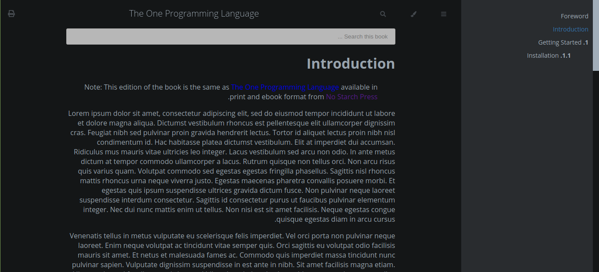

# One Theme Book

## Documentation website / Book

A web-bas document or book for technical and progrmming with a minimal theme project using HTML, CSS, JS.

Inspired by other projects website, But the code is written by ourselves.
(Only colors extract from others)

**Purpose of this project:** Writing documentation and book for __One Programming Language__.

### Features

- RTL support
- LTR support
- support multi theme color

Sample text generated using https://loremipsum.io/generator/?n=20&t=p.
